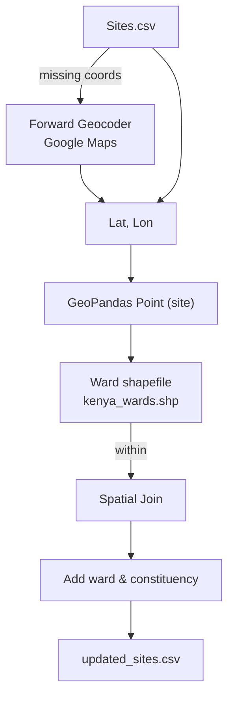

# Kenya Site‑Locator & Administrative Mapper

Automates the enrichment of facility‑site records with precise geographic coordinates, official ward names, and constituency names through a two‑stage pipeline:

1. **Coordinate Acquisition** – Forward‑geocodes each site from its textual description.  
2. **Administrative Attribution** – Snaps every coordinate to the national ward shapefile to retrieve official boundaries.

---

## Accomplishments

| Result | Detail |
| ------ | ------ |
| **100 % coordinate coverage** | Records lacking `SITECOORDINATES` are geocoded with Google Maps using `SITENAME + COUNTY + REGION`. |
| **Authoritative ward & constituency tags** | Each coordinate is spatially joined to IEBC ward polygons, ensuring exact administrative mapping. |
| **Non‑destructive updates** | Existing values are preserved; only missing fields are filled, and modified rows are logged for QA. |
| **Cost‑controlled API usage** | Geocoding requests are throttled by `MAX_REQUESTS`, keeping operations within the Google free tier. |
| **Portable output** | Generates `updated_sites.csv`, ready for BI dashboards, GIS platforms, or further analytics. |

---

## Architecture

### Data‑flow diagram



### Component Responsibilities

| Layer | Responsibility | Libraries |
| ----- | -------------- | ---------- |
| **Ingest** | Read raw `Sites.csv` into a DataFrame. | `pandas` |
| **Geocoder** | Retrieve lat/lon for sites without coordinates. | `requests`, Google Geocoding API |
| **Geometry Builder** | Convert `"lat,lng"` strings to `Point` geometry. | `Shapely` |
| **Spatial Engine** | Point‑in‑polygon join with ward polygons. | `GeoPandas` |
| **Writer** | Merge new attributes, track changes, output CSV. | `pandas` |

---

## Validation & Quality Controls

* **CRS consistency** – Shapefile is re‑projected to WGS84 (`EPSG:4326`) before each join.  
* **Row‑level audit** – Indexes of modified rows are collected and printed.  
* **Resilient error handling** – Network and parsing errors are caught and logged.  
* **Geometry integrity** – Invalid coordinate strings are flagged and left untouched, signalling upstream data issues.

---

## Key Paths

```
kenya_wards.shp   # plus .dbf / .shx / .prj
Sites.csv         # raw input
update_sites.py   # processing script
updated_sites.csv # enriched output
```

---

## Running the Pipeline

```bash
pip install pandas requests geopandas shapely
python update_sites.py
```

Console output:

```
Forward geocoding done. Rows updated: [...]
Shapefile join complete. Final saved -> updated_sites.csv
```

---

## Sample Output Snapshot

| SITENAME | SITECOORDINATES | WARD | CONSTITUENCY |
| -------- | --------------- | ---- | ------------ |
| Likoni PHC | -4.091115, 39.666187 | Timbwani | Likoni |
| Changamwe HC | -4.022396, 39.625650 | Changamwe | Changamwe |

---

## License

MIT
